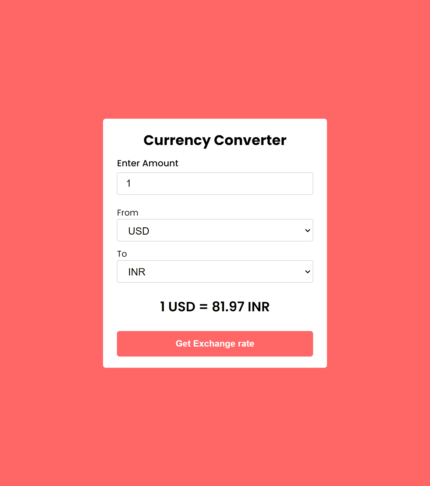

# Currency Converter

# Live Website:- https://js-currency-converter-project.netlify.app/

# Tech Stack

   

 
     
    

## Learnings

- async function to fetch api
- Understand the difference between forEach and map while populating country name droplist
- use of Vite for Vanila JavaScript Environment setup
