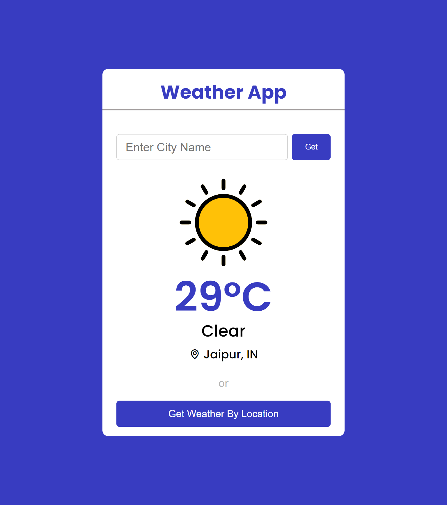

# Weather App

# Live Website:- https://js-weather-website.netlify.app/

# Tech Stack

   

 
     
    

## Learnings

- async function to fetch api
- I learn Gelocation api to get current location
- use of Wepack for file bundling
